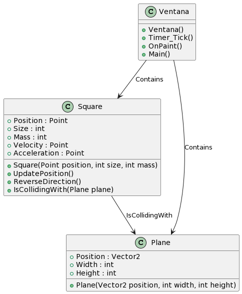

# Proyecto de Mi Motor Gráfico

Este proyecto es una implementación básica de un motor gráfico en C# utilizando Windows Forms. Permite crear una ventana en la que se dibuja un cuadrado que rota y colisiona con un plano.
## Diagrama de Clases

A continuación se muestra el diagrama de clases del proyecto:
<div align="center">
    
</div>

## Cálculos realizados en los archivos

| Archivo           | Método/Función                       | Descripción                                                                                            |
|-------------------|--------------------------------------|--------------------------------------------------------------------------------------------------------|
| Ventana.cs        | Initialize()                         | Configura el entorno OpenGL y la matriz de proyección.                                                 |
| Ventana.cs        | Timer_Tick(state)                    | Actualiza la posición del cuadrado y verifica la colisión con el plano.                                 |
| Ventana.cs        | OnPaint(e)                           | Dibuja el plano y el cuadrado con la textura emisiva en la ventana.                                     |
| Square.cs         | Square(position, size, mass)         | Inicializa un cuadrado con una posición, tamaño y masa dada.                                            |
| Square.cs         | UpdatePosition()                      | Actualiza la posición del cuadrado en función de su velocidad y aceleración.                            |
| Square.cs         | ReverseDirection()                    | Invierte la dirección de la velocidad del cuadrado para simular un rebote.                              |
| Square.cs         | IsCollidingWith(plane)                | Verifica si el cuadrado colisiona con el plano.                                                         |
| Plane.cs          | Plane(position, width, height)        | Inicializa un plano con una posición, ancho y altura dada.                                              |
| OpenGLRenderer.cs | Initialize()                          | Configura OpenGL, habilita capacidades y configura la matriz de proyección y visualización.             |
| OpenGLRenderer.cs | LoadTexture(path)                     | Carga una textura emisiva desde un archivo de imagen y configura los parámetros de la textura en OpenGL. |
| OpenGLRenderer.cs | Render(square, plane)                 | Renderiza el cuadrado con la textura emisiva y el plano en OpenGL.                                      |


## Descripción del Proyecto

El proyecto consiste en una ventana que muestra un cuadrado que rota alrededor de su centro. El cuadrado tiene una velocidad inicial y una aceleración constante que simula una gravedad hacia abajo.

Si el cuadrado colisiona con el plano, se simula un rebote invirtiendo su dirección vertical.

## Requisitos del Proyecto

- Visual Studio 2019 o superior.
- .NET Framework 4.7.2 o superior.

## Ejecución del Proyecto

1. Clona este repositorio en tu máquina local o descarga el código fuente.
    ```shell
    git clone https://github.com/yousseffdil/graphic-engine.git
2. Abre el proyecto en Visual Studio.
3. Compila y ejecuta el proyecto.
4. Se abrirá una ventana donde podrás ver el cuadrado rotando y colisionando con el plano.

¡Disfruta del motor gráfico!
