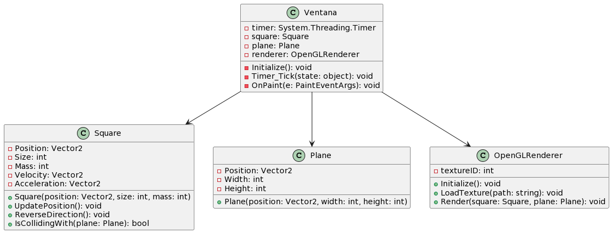

# Proyecto de Mi Motor Gráfico

Este proyecto es una implementación básica de un motor gráfico en C# utilizando Windows Forms. Permite crear una ventana en la que se dibuja un cuadrado que rota y colisiona con un plano.
## Diagrama de Clases

A continuación se muestra el diagrama de clases del proyecto:
<div align="center">
    
</div>


## Descripción del Proyecto

El proyecto consiste en una ventana que muestra un cuadrado que rota alrededor de su centro. El cuadrado tiene una velocidad inicial y una aceleración constante que simula una gravedad hacia abajo.

Si el cuadrado colisiona con el plano, se simula un rebote invirtiendo su dirección vertical.

## Requisitos del Proyecto

- Visual Studio 2019 o superior.
- .NET Framework 4.7.2 o superior.

## Ejecución del Proyecto

1. Clona este repositorio en tu máquina local o descarga el código fuente.
    ```shell
    git clone https://github.com/yousseffdil/graphic-engine.git
2. Abre el proyecto en Visual Studio.
3. Compila y ejecuta el proyecto.
4. Se abrirá una ventana donde podrás ver el cuadrado rotando y colisionando con el plano.

¡Disfruta del motor gráfico!
